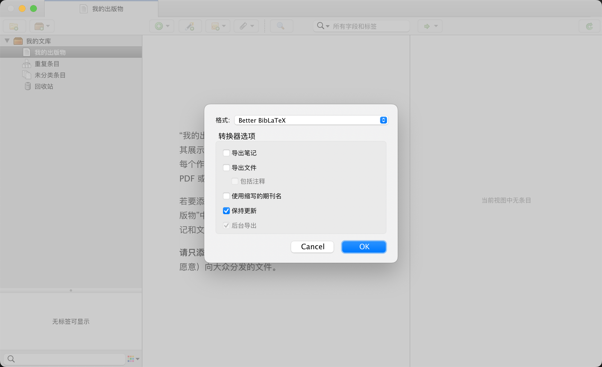

+++
title = "使用 Markdown 写论文（一）"

[taxonomies]
categories = ["杂谈"]
tags = ["Markdown"]
+++

最近在写毕业论文，本文简单记录一下我的论文写作工作流。

## 为什么不用 Microsoft Word？

实际上，学校提供的论文模版就是 Word 格式的，我相信，绝大多数的同学也都是使用 Word 写论文的。那么我为什么不用 Microsoft Word 编写论文呢？

~~用 Word 是不可能用 Word 的，这辈子都不可能用 Word 的。~~

下面就让我简单列举一下 Word 的“罪状”：

- 兼容性。docx 格式几乎完全是微软的私有格式（尽管 Office Open XML 格式已经标准化，但显然微软并没有打算严格遵守），没有任何兼容性保证，不要说用 LibreOffice / WPS 之类的第三方软件，就算是不同平台/不同版本的 Word 都无法保证渲染出来的一定是一样的。
- 呈现与内容分离。Word 是完全违反呈现与内容分离的原则的，在编写时必须时刻调整 Word 的样式，这无疑降低了写作的效率。
- 不是纯文本格式。docx 格式是一个二进制格式，准确来说是一堆 XML 文件的 ZIP 压缩包，导致很难进行版本控制和自动化处理。
- 对文献引用的支持很糟糕。Word 并不是一个专为论文写作设计的应用，因此，它并没有内建任何对文献引用的支持，尽管 Zotero 等工具可以增强其功能，但是仍然不够好用。
- 对公式的支持不够好。尽管我的论文中并没有用到很多公式，但是，显然 Word 并没有对公式排版的一流支持，这对于很多理工科论文是致命的。
- Word 是一个闭源商业软件。尽管我并没有严重的开源软件洁癖，但是，如果有其他选择的话，我仍然希望我的工作流中尽可能使用开源软件。更不要说 Word 对比其他开源软件完全没有优势。
- 跨平台支持。Microsoft Word 仅对 Windows 平台提供了一流的支持，它的 Mac 版非常难用且有着各种功能的缺失，而 Linux 则完全没有任何支持。
- Word 真的非常难用。除了上面这些问题之外，最重要的是：Word 真的非常难用！它的各种操作就是非常不符合逻辑且难以预测，当我复制一段文本再粘贴时，我完全无法预测它会展示成什么样子。样式调整页实在是太复杂了，并且手动成分太高，尽管有样式系统，很多时候仍然需要手动单独调整样式。或许是我了解的还不够深入，但是我真的觉得 Word 的设计很糟糕。

## 为什么不用 LaTeX？

LaTeX 兼容性好、稳定、呈现与内容分离、是纯文本格式、具有一流的引用和公式支持、开源、跨平台、非常强大，并且是论文排版届的事实标准，那么我为什么不用 LaTeX 呢？

因为 LaTex 仍然有几个众所周知的缺点：

- 语法老旧。LaTeX 作为诞生于上世纪 80 年代的古老语言，其语法对比现代标记语言实际上显得有些过于啰嗦和老旧。
- 安装包巨大。LaTeX 的完整安装包巨大，常常达到数个 GB，即使是仅包含核心组件的版本，下载完必要的插件后，也需要数百 MB。
- 中文支持一般。LaTeX 自身对中文的支持并不好，需要通过插件支持中文。
- 编译速度较慢。LaTex 编译生成 PDF 的速度很慢，常常需要数秒到数十秒的时间进行编译，难以做到实时预览。
- 只能生成 PDF 文件。这在通常情况下不是一个问题，但是在国内，仍然有许多场合只接受 docx 文档。

## 为什么不用 Typst？

Typst 作为最新的 LaTeX 替代者，解决了 LaTeX 的大部分缺点，它使用 Rust 编写，具有非常现代的好用的语法，仅需要一个二进制文件就能可以执行，原生支持中文，编译很快。我也使用过 Typst 编写文档，非常好用。唯一的一个问题就是，和 LaTex 一样，只能生成 PDF 文件。我无法确定我们学校是否允许提交 PDF 文件，为了避免不必要的麻烦，我还是决定使用 Markdown，并且 Markdown 也可以很方便地转换为 Typst 文档，如果需要，我也可以直接生成一份 Typst 文档。

## 为什么使用 Markdown？

Markdown 是一个非常简单的标记语言，它非常简洁，易于阅读，易于编写。

Markdown 完全没有包含样式，完全做到了呈现与内容分离，编写时可以完全沉浸在内容中，而不会被其他东西干扰。

更重要的是，因为它足够简单，所以可以很方便地作为中间语言被转换为其他格式，借助 Pandoc，它可以轻松转换为包含 docx、LaTeX、Typst 在内的多种格式。

## 准备

为了使用 Markdown 写论文，我的工作流如下：

- [VS Code](https://code.visualstudio.com/) - 编辑器
- [Pandoc](https://pandoc.org/) - Markdown to docx
- [Zotero](https://www.zotero.org/) - 文献管理
- [draw.io](https://www.drawio.com/) - 插图绘制

## 使用 Pandoc

Pandoc 自称为标记格式转换的瑞士军刀，它可以做到几乎所有文档格式之间的转换，当然，也支持把 Markdown 转换为 docx。

使用 Pandoc 非常简单：

```sh
pandoc [INPUT] -o [OUTPUT]
```

例如：

```sh
pandoc thesis.md -o thesis.docx
```

## 文献管理和引用

如果需要手动写文献引用列表，那也太不优雅了，如果修改调换了引用的位置或者添加了新的引用，还需要手动更新引用文献列表和所有引用的编号。

作为一个程序员，任何能够让计算机自动完成的事情就要让计算机自动去完成。

为了自动进行文献引用，需要两个文件：

- ref.bib - 文献引用列表
- china-national-standard-gb-t-7714-2015-numeric.csl - 文献引用样式

china-national-standard-gb-t-7714-2015-numeric.csl 是一个 [引文风格语言（Citation Style Language）](https://citationstyles.org/)文件，定义了符合 GB/T 7714-2015 标准的引文格式，可以从 [Zotero Style Repository](https://www.zotero.org/styles) 下载。

ref.bib 是 BibLaTeX 格式的文献引用列表，格式如下：

```bib
@article{kingma2014adam,
  title={Adam: A method for stochastic optimization},
  author={Kingma, Diederik P and Ba, Jimmy},
  journal={arXiv preprint arXiv:1412.6980},
  year={2014}
}

@article{vaswani2017attention,
  title={Attention is all you need},
  author={Vaswani, Ashish and Shazeer, Noam and Parmar, Niki and Uszkoreit, Jakob and Jones, Llion and Gomez, Aidan N and Kaiser, {\L}ukasz and Polosukhin, Illia},
  journal={Advances in neural information processing systems},
  volume={30},
  year={2017}
}
```

其中的 `kingma2014adam` 和 `vaswani2017attention` 被称为 citekey，可以 citekey 来引用论文。

通常的论文网站都提供了导出 BibLaTeX 的功能，可以手动复制这些导出的 BibLaTeX 到 ref.bib 文件中。

但是手动复制 BibLaTeX 引用列表还是不够方便的。所以我使用了 [Zotero](https://www.zotero.org/) 来管理文献引用，它是目前最流行的开源文献管理软件之一，支持自动收集参考文献，只需要在浏览器中安装 Zotero 插件，当浏览论文相关的网站时，它会自动识别当前的论文信息，点一下就可以添加到文献列表中。

可以使用 [Better BibTeX for Zotero](https://github.com/retorquere/zotero-better-bibtex) 插件来将 Zotero 文献库导出为 BibTeX 格式。



原生的 Markdown 不支持文献引用，但是 Pandoc 提供了一个拓展语法 `[@citekey]`。

```md
Blah blah [@doe99].
Blah blah [@doe99; @smith2000; @smith2004].
```

具体可以参考 [Pandoc 文档](https://pandoc.org/MANUAL.html#citation-syntax)。

如果需要 Cite While You Write 的话，可以使用 VSCode 插件 [Pandoc Citer](https://marketplace.visualstudio.com/items?itemName=notZaki.pandocciter) 或者 [Citation Picker for Zotero](https://marketplace.visualstudio.com/items?itemName=mblode.zotero)。

除此之外，如果需要对图表、公式或者表格的交叉引用的话，可以使用 [pandoc-crossref](https://github.com/lierdakil/pandoc-crossref)。

## 将 Markdown 转换为 docx

做好了上述准备后，是时候开始用 Markdown 编写论文了。

```md
---
title: 使用 Markdown 编写论文
# lang: zh-CN
link-citations: true
link-bibliography: true
---

::: {custom-style="Title"}
| 摘要
:::

本文简要介绍了如何使用 Markdown 编写论文。

**关键词：** Markdown；Pandoc

::: {custom-style="Title"}
| Abstract
:::
This article provides a brief introduction to how to write a paper using Markdown.

**Keywords:** Markdown; Pandoc

## 引言

<!-- 这里是论文的内容 -->

## 参考文献

::: {#refs}
:::

## 附录

<!-- 这里是论文的附录 -->
```

上面的摘要标题使用了 [custom-style](https://pandoc.org/MANUAL.html#output) 而非直接使用 `##` 标题是为了防止被自动编号。使用 `{.unnumbered}` 尽管可以实现标题不会被编号，但是下一个标题的编号仍然会算上这个标题继续编号，所以使用了 `custom-style` 直接指定 Word 样式。

上面的 Markdown 示例里，最大的标题等级是从二级标题开始的，而在生成 Word 时我希望全部减少一个标题等级，从一级标题开始。之所以不直接从一级标题开始，是因为一个 Markdown 文档有多个一级标题总感觉有点奇怪，也会让 markdown-lint 警告。我使用了一个 [Pandoc Lua Filter](https://pandoc.org/lua-filters.html) 来实现：

```lua
return {
    {
        Header = function(el)
            if el.level > 1 then
                el.level = el.level - 1
            end
            return el
        end
    },
}
```

Pandoc 自动生成的 docx 文件显然无法直接用于论文，Pandoc 支持通过 reference.docx 自定义生成的 docx 文件的样式。

首先生成默认的 reference.docx 文件：

```sh
pandoc -o reference.docx --print-default-data-file reference.docx
```

然后使用 Word 编辑里面的样式，然后使用 `--reference-doc=reference.docx` 参数生成 docx 文件即可。

我使用的 reference.docx 模版是基于 [Achuan-2/pandoc_word_template](https://github.com/Achuan-2/pandoc_word_template) 进行修改得到的。（这里再次吐槽 Word，仅仅是修改模板都实在是太麻烦了！）

于是最终将 Markdown 转换为 docx 的命令如下：

```sh
pandoc \
--toc \
--number-sections \
--citeproc \
--csl china-national-standard-gb-t-7714-2015-numeric.csl \
--bibliography ref.bib \
--reference-doc=reference.docx \
--lua-filter=filter.lua \
thesis.md -o thesis.docx
```

上面的参数的含义如下：

- `--toc`：生成目录
- `--number-sections`：启用标题自动编号（如果使用的模版自带了标题编号，则不加这个参数）
- `--citeproc`：启用文献引用处理
- `--csl china-national-standard-gb-t-7714-2015-numeric.csl`：指定引文格式
- `--bibliography ref.bib`：指定文献引用文件
- `--reference-doc=reference.docx`：指定 docx 模板文件
- `--lua-filter=filter.lua` 设置 Lua Filter

上面的参数有点多，为了方便使用，我创建了一个 `defaults.yaml` 用于代替这些参数：

```yaml
filters:
  - filter.lua

toc: true

number-sections: true
reference-doc: reference.docx

citeproc: true
bibliography: ref.bib
csl: china-national-standard-gb-t-7714-2015-numeric.csl
```

于是最终我的论文用到了这些文件：

```txt
.
├── china-national-standard-gb-t-7714-2015-numeric.csl
├── defaults.yaml
├── filter.lua
├── images
│   └── xxx.png
├── ref.bib
├── reference.docx
├── thesis.docx
└── thesis.md
```

生成 docx 的命令如下：

```sh
pandoc --defaults=defaults.yaml thesis.md -o thesis.docx
```

## 参考资料

- [Pandoc User’s Guide](https://pandoc.org/MANUAL.html#custom-styles)
- [Markdown 写作，Pandoc 转换：我的纯文本学术写作流程](https://sspai.com/post/64842)
- [如何用 Markdown 写论文？](https://sspai.com/post/57082)
