+++
title = "使用 Markdown 写论文（二）"

[taxonomies]
categories = ["杂谈"]
tags = ["Markdown"]
+++

这篇是[上篇](@/2024-02-27-write-thesis-with-markdown-part1/index.md)的续集。

最近要交论文终稿了，学校的通知也说明了需要提交 PDF 格式的论文，那么看起来我没有不使用 Typst 的理由了。

所以，这次我打算把我的论文写作工作流切换到使用 Markdown + Pandoc + Typst。

首先，有一个问题是，我为什么仍然使用 Markdown 转换为 Typst 而非直接使用 Typst 呢？

理由主要有以下两点：

1.  Markdown 的生态更加完善。Markdown 有大量配套工具，而 Typst 则尚且不完善。比如我常用的 Prettier 用于 formatter，markdown-lint 用于 linter。这些在 Typst 中都暂时不存在替代品。并且，虽然 Typst 可以做到实时预览 PDF，但是却无法做到定位当前编辑的位置，当我修改了 Typst 文件后，PDF 会回到文件开头，也无法做到跟随滚动。
2.  Markdown 是一种很好的中间语言。Markdown 可以很方便的转化为任何一种标记语言，它就像是一种所有标记语言的交集，如果未来我希望把我的论文发布在网络上，或者转化为其它语言，Markdown 就可以很方便的做到。

那么，开始我们的 Markdown to Typst 论文写作之旅吧。

## 开始

首先，需要安装 [Pandoc](https://github.com/jgm/pandoc) 和 [Typst](https://github.com/typst/typst)。

```sh
# For macOS
brew install pandoc typst

# For Arch
pacman -S pandoc typst

# For deb
apt install pandoc typst
```

一图胜千言，下面是整个 Markdown to Typst 需要用到的文件和工作流：





文件树：

```txt
.
├── assets
│   └── logo.png
├── build.sh
├── china-national-standard-gb-t-7714-2015-numeric.csl
├── defaults.yaml
├── filter.lua
├── images
│   ├── image1.png
│   └── image2.png
├── ref.bib
├── template.typ
├── thesis.md
├── thesis.pdf
└── thesis.typ
```

## 输入

首先，整个工作流的输入的核心自然就是 thesis.md，Markdown 格式的论文：

````md
---
title: 基于 Pandoc 和 Typst 的论文写作
link-citations: true
link-bibliography: true
---

```thesis
{
    "title": "基于 Pandoc 和 Typst 的论文写作",
    "school": "计算机学院",
    "major": "计算机科学与技术",
    "class": "xxx班",
    "author": "张三",
    "id": "xxxxxx",
    "mentor": "李四",
    "date": "2024-04-11"
}
```

::: preface
:::

## 摘要 {-}

本文简要介绍了如何使用 Pandoc 和 Typst 来撰写论文。

**关键词：** 论文；Markdown；Pandoc；Typst

## Abstract {-}

This article provides a brief introduction to writing papers using Pandoc and Typst.

**Keywords:** Thesis; Markdown; Pandoc; Typst

::: mainmatter
:::

## 引言

这里是引言。

## 一级标题

### 二级标题

#### 三级标题

这里是一个引用[@doe99]，以及一个同时多个引用[@doe99; @smith2000; @smith2004]。

下面是一个表格：

| 名称     | 拓展名 | MIME            |
| -------- | ------ | --------------- |
| Markdown | .md    | text/markdown   |
| PDF      | .pdf   | application/pdf |

Table: 文件格式

下面是一个图片：


下面是一个代码块：

```rust
fn main() {
    println!("Hello World!");
}
```

## 致谢 {-}

感谢 xxx 在本文写作过程中给予的帮助。

## 参考文献 {-}

::: {#refs}
:::

## 附录 1 源代码 {-}

这里是附录。
````

上面基本上是就是普通的 Markdown 语法，但是使用了一些 Pandoc 拓展和自定义拓展。

首先是文件头的 [YAML 元数据块](https://pandoc.org/MANUAL.html#extension-yaml_metadata_block)，这里面使用 YAML 语法指定了论文的标题和一些 Pandoc 设置。

然后是文件开头的语言为 `thesis` 的代码块，这里面用 JSON 语法制定了论文的基本信息，它会被渲染为论文的封面中的信息。

然后是一个 class 为 `preface` 的 [fenced Div](https://pandoc.org/MANUAL.html#extension-fenced_divs) 块，这用于指示论文的前言开始了，下面可以放置论文的中英文摘要。

再之后是一个 class 为 `mainmatter` 的 [fenced Div](https://pandoc.org/MANUAL.html#extension-fenced_divs) 块，这用于指示论文的正文开始了。

参考文献的引用使用了[引文语法](https://pandoc.org/MANUAL.html#citation-syntax)。

表格下面的 `Table: 文件格式` 使用了[表格说明](https://pandoc.org/MANUAL.html#extension-table_captions)。

前面的摘要和最后的致谢、参考文献和附录标题使用了 `{-}` [标题属性](https://pandoc.org/MANUAL.html#extension-header_attributes)，用于不自动编号。

Id 为 `refs` 的 [fenced Div](https://pandoc.org/MANUAL.html#extension-fenced_divs) 块用于[放置参考文献列表](https://pandoc.org/MANUAL.html#placement-of-the-bibliography)。

除了 Markdown 文件，还需要 images 目录用于存储论文中用到的图片，和 ref.bib 文件用于存放参考文献，关于参考文献的管理，参考[上篇](@/2024-02-27-write-thesis-with-markdown-part1/index.md)。

## Pandoc

下一步就是要使用 Pandoc 将 Markdown 文件转化为 Typst 文件。

这一步，需要使用 defaults.yaml 和 filter.lua 文件。

defaults.yaml 文件用于指定 Pandoc 的默认选项，比如使用 `--citeproc` 选项启用 Pandoc 的引用功能，使用 `--filter` 选项指定 filter.lua 文件。

```yaml
filters:
  - filter.lua

wrap: preserve

citeproc: true
bibliography: ref.bib
csl: china-national-standard-gb-t-7714-2015-numeric.csl
```

filter.lua 是这部分的重点，它是一个 [Pandoc Lua Filter](https://pandoc.org/lua-filters.html)，用于把上文中提到的一些自定义拓展语法正确渲染为 Typst。

主要工作就是要把上面的语言为 `thesis` 的代码块语法渲染为：

```typ
#import "template.typ": *
#show: thesis.with(
  title: "基于 Pandoc 和 Typst 的论文写作",
  school: "计算机学院",
  major: "计算机科学与技术",
  class: "xxx班",
  author: "张三",
  id: "xxxxxx",
  mentor: "李四",
  date: (2024, 04, 11),
)
```

把 class 为 `preface`、`mainmatter` 和 id 为 `refs` 的 fenced Div 分别转换为 `#show: preface`、`#show: mainmatter` 和 `#bibliography("ref.bib", title: none, style: "xxx.csl")`。

filter.lua 代码如下：

```lua
local function has_element(list, element)
    for _, value in ipairs(list) do
        if value == element then
            return true
        end
    end
    return false
end

local doc_meta = {}

local THESIS_TEMPLATE = [[
#import "template.typ": *
#show: thesis.with(
  title: "%s",
  school: "%s",
  major: "%s",
  class: "%s",
  author: "%s",
  id: "%s",
  mentor: "%s",
  date: (%s, %s, %s),
)

]]

return {
    {
        Pandoc = function(doc)
            doc_meta = doc.meta
            return doc
        end
    },
    {
        Div = function(el)
            if has_element(el.classes, "preface") then
                return pandoc.RawBlock("typst", "#show: preface\n\n")
            end
            if has_element(el.classes, "mainmatter") then
                return pandoc.RawBlock("typst", "#show: mainmatter\n\n")
            end
            if el.identifier == "refs" then
                return pandoc.RawBlock(
                    "typst",
                    string.format(
                        '#bibliography("%s", title: none, style: "%s")\n\n',
                        doc_meta.bibliography[1],
                        doc_meta.csl
                    )
                )
            end
            return el
        end,
        CodeBlock = function(el)
            if has_element(el.classes, "thesis") then
                local thesis = pandoc.json.decode(el.text)
                local year, month, day = string.match(thesis.date, "(%d+)%-(%d+)%-(%d+)")
                return pandoc.RawBlock(
                    "typst",
                    string.format(
                        THESIS_TEMPLATE,
                        thesis.title,
                        thesis.school,
                        thesis.major,
                        thesis.class,
                        thesis.author,
                        thesis.id,
                        thesis.mentor,
                        year, month, day
                    )
                )
            end
        end,
        Header = function(el)
            if el.level > 1 then
                el.level = el.level - 1
            end

            return el
        end
    }
}
```

使用 `pandoc thesis.md -o thesis.typ --defaults=defaults.yaml` 命令最终生成的 Typst 文件如下：

````typ
#import "template.typ": *
#show: thesis.with(
  title: "基于 Pandoc 和 Typst 的论文写作",
  school: "计算机学院",
  major: "计算机科学与技术",
  class: "xxx班",
  author: "张三",
  id: "xxxxxx",
  mentor: "李四",
  date: (2024, 04, 11),
)

#show: preface

= 摘要

本文简要介绍了如何使用 Pandoc 和 Typst 来撰写论文。

#strong[关键词：] 论文；Markdown；Pandoc；Typst

= Abstract

This article provides a brief introduction to writing papers using Pandoc and Typst.

#strong[Keywords:] Thesis; Markdown; Pandoc; Typst

#show: mainmatter

= 引言

这里是引言。

= 一级标题

== 二级标题

=== 三级标题

这里是一个引用@doe99，以及一个同时多个引用@doe99@smith2000@smith2004。

下面是一个表格：

#figure(
  align(center)[#table(
    columns: 3,
    align: (auto,auto,auto,),
    table.header([名称], [拓展名], [MIME],),
    table.hline(),
    [Markdown], [.md], [text/markdown],
    [PDF], [.pdf], [application/pdf],
  )]
  , caption: [文件格式]
  , kind: table
  )

下面是一个图片：

#figure(image("images/image1.png"),
  caption: [
    一个示例图片
  ]
)

下面是一个代码块：

```rust
fn main() {
    println!("Hello World!");
}
```

#heading(level: 1, numbering: none)[致谢]

感谢 xxx 在本文写作过程中给予的帮助。

#heading(level: 1, numbering: none)[参考文献]

#bibliography("ref.bib", title: none, style: "china-national-standard-gb-t-7714-2015-numeric.csl")

#heading(level: 1, numbering: none)[附录 1 源代码]

这里是附录。
````

## Typst

最后一步就是要将生成的 thesis.typ 文件渲染为 PDF。

这一步主要需要用到定义了符合 GB/T 7714-2015 标准的引文格式的[引文风格语言（Citation Style Language）](https://citationstyles.org/)文件 china-national-standard-gb-t-7714-2015-numeric.csl、Typst 模板 template.typ 和 Typst 模板需要用到的资源文件夹 assets。

template.typ 文件中定义了论文的样式，由于不同的大学对样式的要求都略有不同，所以下面仅介绍一些通用的样式。

首先是论文开头的 `thesis` 函数，这部分设置了一些基础样式，并且在论文开头添加了封面、声明页、目录页等：

```typ
#let heiti = ("Times New Roman", "Heiti SC", "Heiti TC", "SimHei")
#let songti = ("Times New Roman", "Songti SC", "Songti TC", "SimSun")

// 论文开头
#let thesis(
  title: [],
  school: "",
  major: "",
  class: "",
  author: "",
  id: "",
  mentor: "",
  date: (1971, 1, 1),
  body
) = {
  // 设置页面布局
  set page(paper: "a4", margin: (
    top: 2.5cm,
    bottom: 2.0cm,
    left: 2.5cm,
    right: 2cm
  ))

  // 设置字体
  set text(font: songti, size: 12pt, lang: "zh", region: "cn")

  // 封面
  cover(title, school, major, class, author, id, mentor, date)

  // 声明页
  decl-page()

  // 目录页
  outline-page()

  // 设置样式
  // ...

  body
}
```

然后是 `preface` 和 `mainmatter` 函数，它们定义了前言和正文开始时需要进行的操作，包括重新设置页码计数器和设置页码的样式：

```typ
// 前言样式
#let preface(body) = {
  set page(numbering: "I", footer: page-footer("I"))
  counter(page).update(1)

  body
}

// 正文样式
#let mainmatter(body) = {
  set page(numbering: "1", footer: page-footer("1"))
  counter(page).update(1)

  body
}
```

是一些我写一些通用的样式：

设置标题的字号并且设置一级标题居中并自动换页：

```typ
// 设置标题格式
set heading(numbering: "1.1")
let heading-font-size = (0pt, 18pt, 16pt, 14pt, 12pt)
show heading: it => {
  set text(
    weight: "bold",
    font: heiti,
    size: heading-font-size.at(it.level, default: 12pt)
  )
  set block(spacing: 1.5em)
  it
}
show heading.where(level: 1): it => {
  pagebreak()
  set align(center)
  let text = it.body.at("text", default: "")
  if ("摘要", "Abstract").contains(text) {
    sepcial-title(text)
  } else {
    it
  }
}
```

设置代码块的底色，并且当代码块的高度大于 500pt 时允许代码块折页：

```typ
// 设置代块码样式
show raw.where(block: true): set par(justify: false, linebreaks: "simple")
show raw.where(block: true): it => block(
  width: 100%,
  breakable: measure(it).height > 300pt,
  fill: luma(240),
  inset: 10pt,
  radius: 4pt,
  it
)
```

设置表格显示为三线表，将表格的说明设置于表格的上方，并且允许表格的折页：

```typ
// 设置表格样式
show table.cell.where(y: 0): set text(style: "normal", weight: "bold")
set table(
  stroke: (_, y) => if y == 0 {
    (top: 1.5pt, bottom: 0.75pt)
  } else if y == 1 {
    (top: 0.75pt, bottom: 0pt)
  } else {
    (bottom: 1.5pt, top: 0pt)
  }
)
show figure.where(kind: table): set figure.caption(position: top)
show figure.where(kind: table): set block(breakable: true)
```

最后，在做好相关的准备之后，只需要执行 `typst compile thesis.typ` 即可生成最终 PDF 格式的论文啦。

## 参考

- [Pandoc Lua Filters](https://pandoc.org/lua-filters.html)
- [Typst Documentation](https://typst.app/docs/)
- [HUST-typst-template](https://github.com/werifu/HUST-typst-template)
- [modern-nju-thesis](https://github.com/nju-lug/modern-nju-thesis)
