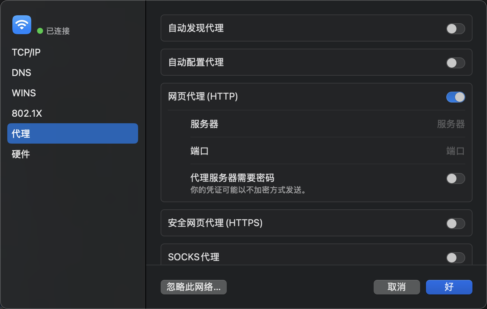
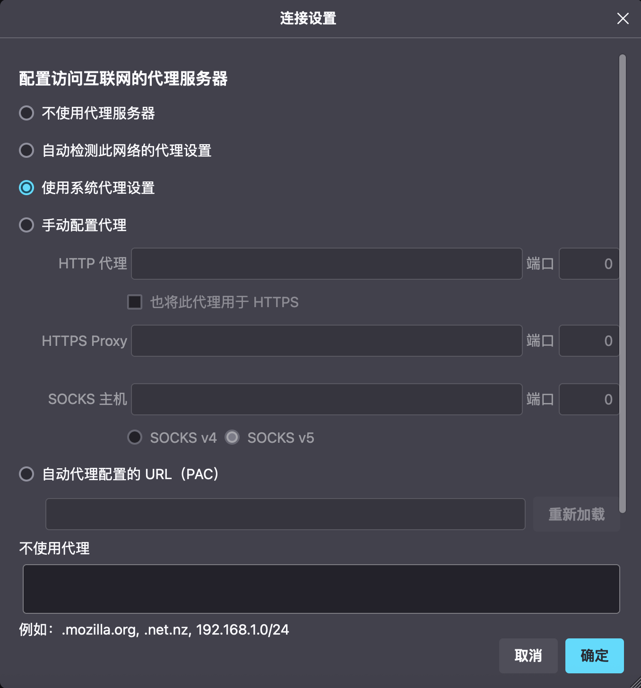

+++
title = "理解代理"

[taxonomies]
categories = ["Network"]
tags = ["Network", "Proxy"]
+++

在网上冲浪时，我们难免需要访问一些“不安全”的网站，我们可能不希望这些不安全的网站得知我们的真实 IP 地址，在这种情况下，代理可以帮助我们。

或者，我们处于公司的内网，需要访问公共互联网，但是公司的防火墙禁止用户直接访问互联网，公司的网络管理员通常会提供一个代理服务器用于访问。





## 准备

在开始理解代理之前，首先需要复习一些计算机网络知识。

### OSI 模型

OSI 模型将通讯系统中的数据流划分为了七个层：

- L7 应用层：唯一直接接触用户的层。定义了应用程序之间通讯的接口。
- L6 表示层：处理格式转换（加密、压缩、编码）。
- L5 会话层：设置和维护两个设备之间的通信（维持会话）。
- L4 传输层：两个设备间的端到端通信（流量控制和错误控制）。
- L3 网络层：两个不同网络之间的数据传输（路由）。
- L2 数据链路层：设备点对点的网络寻址、错误检测和错误控制。
- L1 物理层：参与数据传输的物理设备。





上图描述了 OSI 七个层在常见应用场景下的对应的协议和在终端设备（PC）上的常见实现。

这里只是“常见”实现，因为理论上每一层完全可以独立存在。上层的协议对于下层的来说只是其承载的内容而已，下层协议对于上层的协议来说只是载体。每一层之间就像俄罗斯套娃一样。

比如，HTTP 协议只是定义了一个基于文本的格式，实际上完全可以不依赖 TCP/IP 协议传输 HTTP 请求，比如，把 HTTP 请求文本写在纸上，让信鸽来传递（IPoAC，[RFC 1149](https://datatracker.ietf.org/doc/html/rfc1149)）。

现实中 TCP/IP 协议也是运行在不同的数据链路层/物理层的，比如 Ethernet + 双绞线、Ethernet + 光纤、Wi‑Fi + 射频等。

### DNS

众所周知，一般人在使用互联网时不会在浏览器中输入 IP 地址来访问网站，而是输入域名，但是上述的 TCP/IP 协议实际上只认识 IP 地址，所以，需要 DNS 服务将域名转换为 IP 地址。DNS 服务类似一个电话簿，用户发送一个域名，它就可以返回对应的 IP 地址。当然，DNS 服务器还有更多功能，这里指的是最基础的 A 记录。

如上一节所说，和 HTTP 协议类似，DNS 协议也可以建立来不同的层级之上，传统的 DNS 协议是 DNS over UDP，即建立在 UDP 协议上的 DNS 协议，除此之外，还有 DNS over TCP、DNS over TLS、DNS over HTTPS 等。

当用户在浏览器中输入一个网址时，会经历以下过程：

1.  缓存检查：浏览器检查本地 DNS 缓存、HTTP 缓存等，存在则可以跳过一些步骤。
2.  DNS 解析：向 DNS 服务器发送请求，将域名转换为 IP 地址。
3.  建立 TCP 连接：发送三次握手，和远程服务器建立 TCP 链接。
4.  建立 TLS 连接：如果使用的是 HTTPS 协议，则与远程服务器进行密钥协商、证书校验等，建立加密隧道。
5.  发送 HTTP 请求：组装一个标准的 HTTP 报文，通过 TCP/TLS 通道发往服务器。
6.  处理请求：服务器处理请求，生成 HTTP 响应，发送给客户端。
7.  解析和渲染：浏览器解析响应信息，并将内容渲染在屏幕上。
8.  连接关闭：根据特定策略关闭 TCP/TLS 连接，处理缓存逻辑。

## HTTP 代理

为了不让那些不安全的网站获取的真实的 IP 地址，最简单的方案就是使用 HTTP 代理。

HTTP 代理位于 L7 应用层，它的工作原理十分简单，比如，我希望请求 `unsafe.example.com` 这个不安全的网站，可以不直接请求这个网站，而是转而请求 `proxy.example.com` 这个运行了代理服务器的网址，代理服务器会读取 HTTP 请求头中的 `Host` 字段，以得知用户真正需要请求的网站，代替用户发送网络请求，并将响应结果返回给用户。这样，网站只知道代理服务器的 IP 向它发送了一个请求，而不知道用户真实的 IP 地址。这也就是“代理”这一个词的含义，代替用户发送网络请求。

其原理非常简单，下面是一个用于描述其原理的简单示例：

```py
from http.server import BaseHTTPRequestHandler, HTTPServer

import requests

LISTEN_HOST = "127.0.0.1"
LISTEN_PORT = 8888


class ProxyHandler(BaseHTTPRequestHandler):
    def _proxy(self):
        # 构造目标 URL
        target_url = f"http://{self.headers['Host']}{self.path}"
        # 准备请求头
        headers = {k: v for k, v in self.headers.items() if k.lower() != "host"}
        # 读取请求体
        body = None
        if "Content-Length" in self.headers:
            length = int(self.headers["Content-Length"])
            body = self.rfile.read(length)
        # 发起请求
        resp = requests.request(
            self.command, target_url, headers=headers, data=body, stream=True
        )
        # 转发状态码和头部
        self.send_response(resp.status_code)
        for k, v in resp.headers.items():
            if k.lower() not in ("content-encoding", "transfer-encoding", "connection"):
                self.send_header(k, v)
        self.end_headers()
        # 转发响应体
        for chunk in resp.iter_content(4096):
            self.wfile.write(chunk)

    def do_GET(self):
        self._proxy()

    def do_POST(self):
        self._proxy()


if __name__ == "__main__":
    server = HTTPServer((LISTEN_HOST, LISTEN_PORT), ProxyHandler)
    print(f"[+] http://{LISTEN_HOST}:{LISTEN_PORT}")
    server.serve_forever()
```

HTTP 代理是一个通用的协议，一般可以直接在操作系统中设置，这样应用程序读取到这个配置后就知道自己不应该直接发送网络请求，而是应该发送到代理服务器的网址。



还有一些软件，例如 FireFox，则是提供了自己单独的代理设置。



但是，简单的 HTTP 代理有一些问题：

1.  出于一些原因，代理服务器可能并不直接向外提供 HTTP 代理服务，而是提供某种加密的代理服务，即用户在发送前先将请求体加密，代理服务器收到后先解密，再进行转发。但是，很显然，应用程序通常并不支持这种非标准的协议。
2.  我们不仅需要访问一些“不安全”的网站，也需要访问一些“安全”的网站，访问“安全”网站时，我们不希望走代理。而 HTTP 代理是一个全局配置，一旦配置所有 HTTP 网络请求都会走代理。

## 本地代理

为了实现自动分流和加密协议代理，我们需要在本地启动一个代理服务器（以下简称代理软件），这个代理软件将根据一个网站名单决定如何转发请求。对于名单内的网站将转发给位于远程的代理服务器，而其他网站则直接请求。

并且，代理软件还可以进行代理格式的转换：暴露一个普通的 HTTP 代理服务给用户，而在转发给远程代理服务器时则可以使用其实现的任意非标准协议。

看起来很很完美，我再也不用担心被不安全的网站获取真实的 IP 地址啦！

但是还是有一个“小问题”，应用程序可能并不会使用我们配置的 HTTP 代理。

正如 HTTP 代理一节所说，当我们设置了 HTTP 代理后，应用程序将会请求代理服务器而非原本的地址，但是，这完全是应用程序“自愿”的选择，它应该这样做，但也完全可以选择不这样做。当我们在操作系统中设置了 HTTP 代理后，操作系统只是会告诉应用程序现在设置了代理，例如通过 `HTTP_PROXY` 和 `HTTPS_PROXY` 环境变量，但是是否真的要请求代理服务器则完全是应用开发者的选择，有些应用程序并没有支持代理功能，或者有自己的代理设置，需要分别设置。

并且正如它的名字和工作原理，HTTP 代理自然只支持 HTTP 协议，无法处理任何其他网络请求，比如同样位于 L7 应用层的 SMTP、FTP、SSH 等协议，还有位于更底层的 TCP/UDP/ICMP 等协议。

## 明确需求

让我们先来系统地梳理一下我对代理的需求：

1.  按照网站分流：
    1.  我拥有一份不安全的网站（或者公司外部网站）的名单，我希望使用代理访问它们。
    2.  我拥有一份安全的网站（或者公司内部网站）的名单，我希望直接访问他们。
    3.  对于其他未知的网站可以根据需要选择直接访问或者通过代理访问（下面假设对于这种网站也通过代理访问）。
2.  支持 TCP/UDP：除了 HTTP 之外的其他 TCP/UDP 通讯也要支持通过代理。
3.  透明代理：应用程序不需要额外配置就会自动走代理，即代理的存在对于应用程序来说是透明的，它并不知道自己在通过代理访问网络。
4.  准确的 DNS：我们本地的 DNS 服务器可能是不准确的，比如，公司内网可能存在自己搭建的 DNS 服务器，它可能更新不及时，造成查询结果不正确。

    但是，对于公司内部网站，我们还是应该优先使用公司内部的 DNS 服务器，因为它更加快速，并且只有公司内部的 DNS 服务器才记录了公司内部域名的信息。

    也就是说，需要走代理的网站的 DNS 解析也要走代理。不走代理的网站的 DNS 解析也不走代理。

5.  性能：实现上述功能的前提下，网络性能尽可能好。

当前的本地 HTTP 代理软件方案可以实现，1. 分流、4. 准确的 DNS 和 5. 性能。能实现 4 因为其发送给远程代理服务器的就是域名，代理服务器自然会在远程进行 DNS 解析。

## TUN 代理

首先我们如何让尽可能多的网络请求经过代理呢？

很简单，让代理软件工作在 OSI 模型中尽可能低的层级。

如果不考虑实际连一条光纤到代理服务器的话，我们能够控制的最低的层级就是 L2/L3——虚拟网卡，又称 TAP/TUN。

一般情况下，我们不会考虑 TCP/IP 协议之外的情况，因此，我们选择工作在 L3 网络层的 TUN，这在桌面端平台上对应虚拟网卡设备，在移动平台上则对应系统提供的 VPN（狭义的）接口。

TUN 代理要做的第一步就是进行 L3 到 L4 的转换，代理软件将会解析 IP 数据包中的内容，从其中提取出 TCP/UDP 协议内容。

但是，我们又遇到了一个新的问题，现在代理对于应用程序来说是透明的，代理软件无从得知用户请求的域名。如果是 HTTP 代理，它可以通过 HTTP 请求头中的 `Host` 请求头得知需要请求的域名，从而按照黑白名单进行分流。但是现在，应用并不知道自己正在走代理，因此进行的还是正常的请求流程：先进行 DNS 解析，拿到 IP 再进行请求。这时位于 L3/L4 的代理软件拿到的只有 IP，无法按照域名进行分流。

这个问题看似无解，但好在聪明的代理软件开发者想到了一个解决方案——域名嗅探。代理软件可以进一步解析 TCP 协议承载的内容，如果分析得到其内容类似 HTTP 协议，则可以按照之前的流程提取出域名。除了 HTTP 协议外，代理软件通常实现了更多常见的协议的嗅探。

现在我们成功实现了 1. 分流、2. 支持 TCP/UDP 和 3. 透明代理。

## DNS 劫持

现在，剩下的就是如何解决我们本地的 DNS 服务器不够准确的问题。

思路和域名嗅探类似，DNS 协议运行于特定的端口（DNS over UDP 运行于 53 端口），并且像 HTTP 一样，DNS 请求也具有一定的特征，代理软件可以得知当前请求是 DNS 协议，并对其进行劫持。

当代理软件发现应用程序发送了一个 DNS 请求时，不会实际执行这个请求，而是先判断这个域名在哪个名单中，按照规则请求本地的 DNS 服务器或者通过代理请求特定公共 DNS 服务器。

似乎所有问题都解决了……吗？

## 性能问题

别忘了，我们还有最后一个要求，性能要足够好。

虽然刚才提到的过程看起来很复杂，L3 到 L4 转换、协议嗅探、DNS 劫持、域名分流等等，但对于现代的计算机来说，这些计算任务都不是问题，网络请求才是最耗时间的。

但是看起来刚才的流程中并没有引入新的网络请求啊，为什么会影响性能呢？那是因为 DNS 解析并不如同我们刚才讲到的那么简单。

现代网站都依靠 CDN 加速网络请求，简单来说，就是部署很多服务器，用户优先访问距离自己最近的服务器获取内容，以加速网络请求。这个过程是要依赖 DNS 服务器的。当用户向 DNS 服务器请求有 CDN 加速的网站时，DNS 服务器可以根据请求者的 IP 地址返回距离其最近的 CDN 服务器的 IP 地址。

但是，当我们通过代理请求 DNS 服务器时，DNS 服务器可能无法返回距离代理服务器最近的 CDN 节点的 IP。

为了解决这个问题，我们希望代理服务器知道我正在访问的域名。这一方面是为了让代理服务器自行请求其配置好的最佳 DNS 服务器解析得到 IP 地址，以获得最佳的 CDN 命中。另一方面，也是为了允许代理服务进行二次分流，代理服务器可以根据请求的网站域名按照特定规则再次分流给二级代理服务器。

解决的方案还是域名嗅探，我们可以让代理软件在域名嗅探完成后不直接转发 IP 地址，而是用嗅探出的域名代替 IP 地址再转发给代理服务器。

但是，这个方案还是有一个问题，那就是造成了冗余的 DNS 请求。现在浏览器访问一个需要被代理的网站的流程如下：

1.  浏览器发起 DNS 解析
2.  代理软件劫持 DNS 请求
3.  代理软件通过远程代理请求公共 DNS
4.  浏览器使用拿到的 IP 地址发起网络请求
5.  代理软件进行域名嗅探，拿到实际请求的域名
6.  代理软件使用域名代替 IP 转发给代理服务器
7.  代理服务器请求 DNS 服务器拿到 IP
8.  代理服务器使用 IP 实际发出请求

可以看到，第一次 DNS 解析得到的结果完全没有被用到，这次 DNS 请求只是因为应用程序不知道自己处于代理环境导致的。

此外，使用嗅探出的域名代替 IP 地址还有一定风险，即嗅探出来的域名不一定是正确的。以 HTTP 请求为例，毕竟 `Host` 也只是一个请求头，用户完全可以手动发起一个带有特定 `Host` 请求头，但是实际指定向某个 IP 请求的 HTTP 请求，而如果强行用 `Host` 替代 IP，就会导致请求了错误了服务器。也就是说，用嗅探出来的域名做分流没问题，最多只是选错这个请求需要直连还是走代理而已，但如果用于转发，在极少数情况下就可能会出错了。

似乎，鱼与熊掌不可兼得？

## FakeIP

FakeIP 是 IETF 在 [RFC 3089](https://datatracker.ietf.org/doc/html/rfc3089) 中提供的一个网关方案。

所谓 FakeIP，是指代理软件可以在劫持 DNS 请求后，不转发这次 DNS 请求，而是立即返回一个假的 IP 地址（FakeIP），并在自己的数据库中新增一条记录：FakeIP -> 域名。后续，当应用程序请求这个 FakeIP 时，就查询出真正的域名，使用记录的域名请求远程代理。这样就避免了冗余的 DNS 解析。在返回 FakeIP DNS 结果时，会将其 TTL 写为 1，以避免应用程序缓存 FakeIP 的 DNS 结果，导致在代理关闭后仍然使用 FakeIP 请求网站。

那么，我们是否应该为既不在安全网站名单，也不在不安全网站名单中的未知网站启用 FakeIP 呢？

理论上来说，因为未知网站也会通过代理请求，为了实现最佳的性能，启用 FakeIP 是合理的。但是，我们的列表可能并不全是域名列表，还有 IP 列表。假设我们拥有四种匹配规则：安全域名、不安全域名、安全 IP、不安全 IP。如果我们在 DNS 解析时，对不安全域名和未知域名均采取了 FakeIP，那么在路由时，IP 类的匹配规则就无法生效了。比如，存在一个未知域名，它实际指向了一个安全的 IP，由于我们在 DNS 解析时没有实际解析，而是将其解析为了 FakeIP，那么路由阶段就无法正确匹配“安全 IP”规则，导致本不需要走代理的网站错误地走了代理。

因此，综合考虑性能和正确性，最终完整的方案如下：





## 下一步？

现在的方案真的是完美的吗？代理软件还有什么问题呢？

1.  ICMP 协议：目前，TUN 代理软件虽然运行于 L2，但是，实际上它并无法正确处理 ICMP 协议，也就是 ping 使用的协议。目前，对于 ICMP 协议，代理软件通常使用两种方式处理：不代理 ICMP 通讯或者直接立即返回假的 ICMP 结果。前者会导致 ping 需要代理的网站时无法 ping 通，而后者则会导致 ping 无法真实反应通讯延迟和丢包情况（ping 在亚毫秒内返回）。部分软件可能会依靠 ping 确定服务器的可用性或者选择最佳的服务器，这些软件在使用代理时无法正常工作。
2.  FakeIP：尽管 FakeIP 可以几乎完美地解决代理的性能问题，但是，使用 FakeIP 会让透明代理变得没有那么“透明”。FakeIP 对需要代理的网站的 DNS 请求返回一个内网 IP 地址，这使得应用程序可以通过这一特征判断出当前可能正在使用代理软件（至少说明 DNS 服务出了什么问题）。当然，大部分软件都不会因此改变行为，但理论上软件可以由此检测代理的存在。当然，HTTP 代理根本就不是透明代理。使用 TUN 代理时即使不使用 FakeIP 也总是会存在一些应用程序可以获取的特征，比如在移动平台上，应用程序可以得知是否启用了 VPN，桌面端平台上，应用程序也可以检查是否存在 TUN 虚拟网卡。

这些问题还有待代理软件的开发者进一步提出新的解决方案。

## 参考

1.  [什么是 OSI 模型？](https://www.cloudflare.com/zh-cn/learning/ddos/glossary/open-systems-interconnection-model-osi/)
2.  [我有特别的 DNS 配置和使用技巧](https://blog.skk.moe/post/i-have-my-unique-dns-setup/)
3.  [sing-box tproxy](https://lhy.life/20231012-sing-box-tproxy/)
