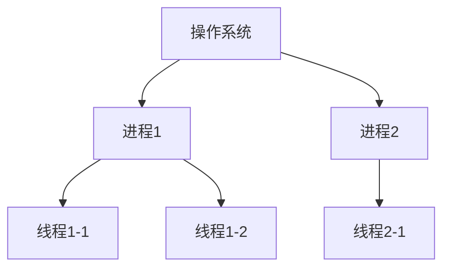

网络上大部分关于 Python 异步 IO 的教程受制于历史原因，往往都是从基于生成器的协程开始讲起的，但是，基于生成器的协程在 Python 3.8 版本中已经被弃用并且将在 Python 3.10 版本中被移除，从 Python 3.7 版本开始，异步 IO 库也发生了许多更改，添加了许多便于使用的高层级 API ，但许多教程仍只涉及低层级 API，使初学者非常迷惑，觉得异步 IO 是一个很难使用的东西。为了尝试解决这些问题，我写了这篇教程，本篇仅涉及 Python 异步 IO 的基本概念和常用的非常简单的使用方法。

## 异步 IO 与并发执行

首先我们要明白的异步 IO 的本质是什么。

如果我们希望一个代码能够并发执行，有这几种方式，多进程，多线程和协程，它们在 Python 中分别对应了 [multiprocessing](https://docs.python.org/zh-cn/3/library/multiprocessing.html)， [threading](https://docs.python.org/zh-cn/3/library/threading.html) 和 [asyncio](https://docs.python.org/zh-cn/3/library/asyncio.html) 库，在历史上，进程曾是大部分分时系统中程序运行的基本单位，而在现代操作系统中，进程是线程的容器。通俗的来讲，系统中运行的每一个程序都是一个进程，而每个进程有包含多个线程。每个线程都可以并行运行。



但是，实际上它们真的在并行运行吗？答案是不确定的，这取决于 CPU 的核心数，在“远古”时代，CPU 只有一个核心，所以在物理层面上，进程与线程并没有办法并行执行，于是操作系统用一个方法“骗过”了用户，通过快速地切换运行的进程来产生一种它们正在并行运行的错觉，所以如果你的电脑只有一个核心，并且你的程序只涉及单纯的 CPU 计算，那么多线程或多进程并不会提高运行的效率，反而可能会因为调度过程中的损耗而浪费部分 CPU 资源。但好在现在的 CPU 都有多个核心了，每个线程可以在独立的 CPU 上运行，所以多线程技术可以显著加快计算的速度。不过 Python 语言的最常用实现 CPython 由于 GIL 的存在，并不能很好的利用多线程，所以对于 CPU 密集型的程序需要使用多进程代替多线程。

实际上，计算机的 CPU 的运算速度远远大于网络或磁盘等 IO（输入/输出）。在很多情境下，我们的程序都不是 CPU 密集型，而是 IO 密集型的，也就是频繁地访问网络或磁盘，而对于 CPU 计算消耗的时间不是很敏感。

传统的同步 IO，在 IO 操作过程中当前线程会被挂起，线程会等待 IO 操作完成在继续完成下面的代码。举一个例子，我们的程序要下载 100 个文件，如果我们使用同步 IO，程序向服务器发送一个网络请求，等 1 秒才能获得返回的信息，程序会等待返回信息后再继续进行下一个请求，100 个文件就需要至少 100 秒。所以我们必须使用多线程或多进程来并行下载，100 个线程同时发出网络请求，然后一起等 1 秒，一共只需要消耗 1 秒。

但是这里使用多线程或者多进程也许有些浪费，毕竟多线程会造成额外的系统资源开销，进程和线程数量也不能无限多下去，并且稍有不慎还会造成各种奇怪的 bug。或许我们可以试图从源头解决问题，那就是为什么 IO 操作一定要阻塞线程呢？可以想象这样的一种情况，程序发送一个网络请求，但不等待它返回结果就继续发送第二个网络请求，以此类推，发送请求是 CPU 操作，100 个请求可能只需要 1 毫秒就能完成，然后等待它们返回后再进行处理，同样，一共也只需要 1s 就能完成！这就是异步 IO，为了更好地发挥异步 IO 的威力，Python 引入了协程的概念。

## 协程

协程（Coroutines）又叫纤程（Fiber）。我们暂且将协程理解为一种特殊的子程序（函数）。


实际上，上面的那句话是错误的，正确的是：子程序是协程的一种特例。

不过大多数语言都有子程序的概念，但不一定有协程的概念，在 Python 中函数也并不是协程的子类。


在 Python 中协程用 `async/await` 语法进行声明：

```python
import asyncio

async def main():
    await foo()
    print('end')

async def foo():
    print('hello')
    await asyncio.sleep(1)

asyncio.run(main())
```

协程在声明时需要使用 `async def` 代替 `def` ，而在调用时需要使用 `await` 来代替直接调用。不使用 `await` 直接调用一个协程并不会使它运行，只会得到一个协程对象。

在最外层则需要通过 `asyncio.run()` 来运行一个协程。

上面的程序的运行结果应该类似于：

```python
import time

def main():
    foo()
    print('end')

def foo():
    print('hello')
    time.sleep(1)

main()
```

那么我们多写了那么多代码到底有什么用呢？虽然它们运行的效果是相同的，但是原理却并不相同，前者在调用 `await asyncio.sleep(1)` 时它实际上是挂起了当前的**任务**，以允许其他任务的运行，当然这里并没有其他的任务。后者的 `time.sleep(1)` 则是挂起（阻塞）了当前的**线程**。

## 可等待对象

上面我们提到了 `await` 语句用于运行协程，实际上它表示的是等待协程运行完毕，就像同步程序一样，所以上面的两个程序效果是相同。

在 Python 中所有可以被 `await` 语句等待的对象都叫做可等待对象，协程就是一种可等待对象。可等待对象有三种主要类型：协程（coroutine），任务（Task）和 Future 。

其中 Future 是一种低层级的可等待对象，我们暂且不讨论，下面我们来了解一下任务。

## 任务

在 Python 中任务被用来“并行的”调度协程。通过 `asyncio.create_task()` 函数来将协程封装为一个任务，并**自动调度运行**。

```python
import time
import asyncio

async def foo(i):
    print(f'Running foo {i}')
    await asyncio.sleep(1)
    print(f'End foo {i}')

async def main():
    print(f"Started at {time.strftime('%X')}")
    task_list = []
    for i in range(10):
        task_list.append(asyncio.create_task(foo(i)))
    for task in task_list:
        print(await task)
    print(f"Finished at {time.strftime('%X')}")

asyncio.run(main())
```

运行上述代码，会发现，程序只用了 1 秒就运行完成了。

我们来具体解读一下，首先在 `main()` 协程中先创建了 10 个任务，并储存在 `task_list` 列表中，然后再依次等待这些任务完成。

如果没有后面的等待的话，程序就会在那些任务还没有完成的情况下结束。如：

```python
import time
import asyncio

async def foo(i):
    print(f'Running foo {i}')
    await asyncio.sleep(1)
    print(f'End foo {i}')

async def main():
    print(f"Started at {time.strftime('%X')}")
    for i in range(10):
        asyncio.create_task(foo(i))
    print(f"Finished at {time.strftime('%X')}")

asyncio.run(main())
```

因为最外层是 `asyncio.run(main())` 当 `main()` 协程执行完毕程序就会结束，而不会管其他任务是否已经完成。

Python 还提供了一个函数用于替代上面的写法：

```python
import time
import asyncio

async def foo(i):
    print(f'Running foo {i}')
    await asyncio.sleep(1)
    print(f'End foo {i}')
    return i + 1

async def main():
    print(f"Started at {time.strftime('%X')}")
    coroutine_list = [foo(i) for i in range(10)]
    result = await asyncio.gather(*coroutine_list)
    print(result)
    print(f"Finished at {time.strftime('%X')}")

asyncio.run(main())
```


`asyncio.gather()` 的内部实现和之前的代码并不相同，只是效果类似。


上面所有例子中的 `asyncio.sleep(1)` 都可以换成真实的 IO 操作，比如下面的使用 `httpx` 库获取网页的例子。

```python
import time
import asyncio
import httpx

async def foo(i):
    print(f'Running foo {i}')
    async with httpx.AsyncClient() as client:
        r = await client.get('https://www.example.org/')
    print(f'End foo {i}')
    return r

async def main():
    print(f"Started at {time.strftime('%X')}")
    coroutine_list = [foo(i) for i in range(10)]
    result = await asyncio.gather(*coroutine_list)
    print(result)
    print(f"Finished at {time.strftime('%X')}")

asyncio.run(main())
```

再次强调，协程不是多线程，上面的所有操作都是在一个线程中完成的，它之所以可以实现类似于并行执行的效果，是因为它没有等待 IO 操作完成，在上面的例子中程序发送了对 `https://www.example.org/` 的第一次请求后，没有等待服务器响应，而是挂起了当前任务，于是第二个任务拿到了控制权，并进行了第二次网络请求，以此类推，这些发送请求全都发生在很短的时间内，然后当其中一个任务的请求有了回应，这个任务便会被唤醒，并继续执行剩下的代码。

你会发现，这种多个任务“并行”执行的方式很像之前提到的在只有一个 CPU 的情况下多线程的模式，使用协程的好处与多线程这种让系统去调度每个线程何时运行相比，我们可以自己决定何时切换任务，更加的高效和灵活，即只在发生需要耗费时间的 IO 操作时我们使用 `await` 等待它完成并挂起当前任务，切换至未处理的任务。

我们可以用下图清晰地表示使用多线程和协程任务进行并发处理的不同：

```mermaid
gantt
    dateFormat  DD
    axisFormat  %d
    todayMarker off
    title 协程任务
    section Task 1
    网络请求    :crit, done,   task11, 01, 1d
    等待响应    :      active, task12, after task11, 15d
    处理响应    :crit, done,   task13, after task12, 1d
    section Task 2
    网络请求    :crit, done,   task21, 02, 1d
    等待响应    :      active, task22, after task21, 15d
    处理响应    :crit, done,   task23, after task22, 1d
    section Task 3
    网络请求    :crit, done,   task31, 03, 1d
    等待响应    :      active, task32, after task31, 15d
    处理响应    :crit, done,   task33, after task32, 1d
```

```mermaid
gantt
    dateFormat  DD
    axisFormat  %d
    todayMarker off
    title 多线程/多进程（线程/进程数 < CPU 核心数）
    section Task 1
    网络请求    :crit, done,   task11, 01, 1d
    等待响应    :      active, task12, after task11, 15d
    处理响应    :crit, done,   task13, after task12, 1d
    section Task 2
    网络请求    :crit, done,   task21, 01, 1d
    等待响应    :      active, task22, after task21, 15d
    处理响应    :crit, done,   task23, after task22, 1d
    section Task 3
    网络请求    :crit, done,   task31, 01, 1d
    等待响应    :      active, task32, after task31, 15d
    处理响应    :crit, done,   task33, after task32, 1d
```





看上面的图，你可能觉得还是多线程效率更高些，但事实并非如此，首先，上面的图并非真实的比例，真实情况下，等待响应的时间会远远大于网络请求和处理响应的时间，上面的差距可以忽略不计。其次，上面的图有一个前提就是线程/进程数小于 CPU 核心数，若大于的话也并不会进一步提高效率，往往并行 IO 操作数量都是大于用户的 CPU 核心数的。最后，切换进程是会耗费额外的资源的，相比之下，协程切换任务的消耗则要小一些。

## 总结

1. **同步 IO 和异步 IO**

   同步 IO 在进行 IO 操作时会阻塞当前进程，而异步 IO 则不阻塞。

2. **可等待对象**

   ```mermaid
   graph TD;
       可等待对象-->A[协程 coroutine];
       可等待对象-->B[任务 Task];
       可等待对象-->C[Future];
   ```

   任务（Task）是由协程（coroutine）使用 `asyncio.create_task()` 函数封装而成的，用于并行调度协程。

3. **运行一个协程**

   - `asyncio.run()` 函数：用于运行最高级入口点，如 `main()` 协程。
   - `await` 语句：等待一个协程，等待这个协程返回结果后继续运行下面代码。
   - `asyncio.create_task()` 函数：将一个协程包装为一个任务并且并发地调度协程。


如果你使用了异步 IO，请尽量在程序的所有地方都使用协程，网络请求等 IO 库也要使用支持异步 IO 的库，如 [aiohttp](https://docs.aiohttp.org/)， [httpx](https://www.python-httpx.org/) 等。


## 参考

建议参考以下内容：

- [协程与任务 - Python 文档](https://docs.python.org/zh-cn/3/library/asyncio-task.html)
- [同步原语 - Python 文档](https://docs.python.org/zh-cn/3/library/asyncio-sync.html)
- [事件循环 - Python 文档](https://docs.python.org/zh-cn/3/library/asyncio-eventloop.html)
